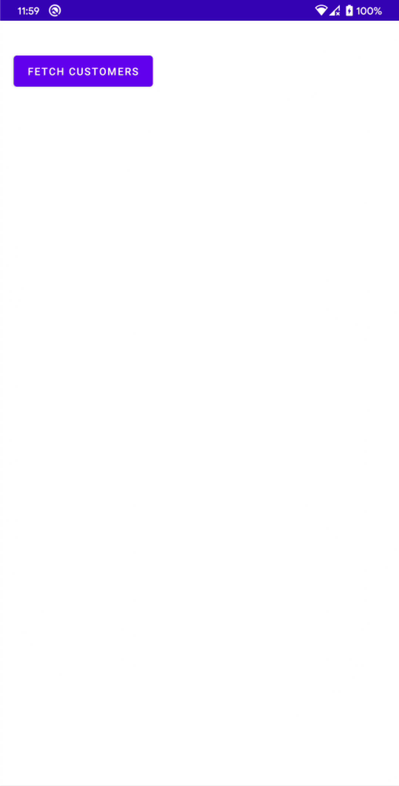
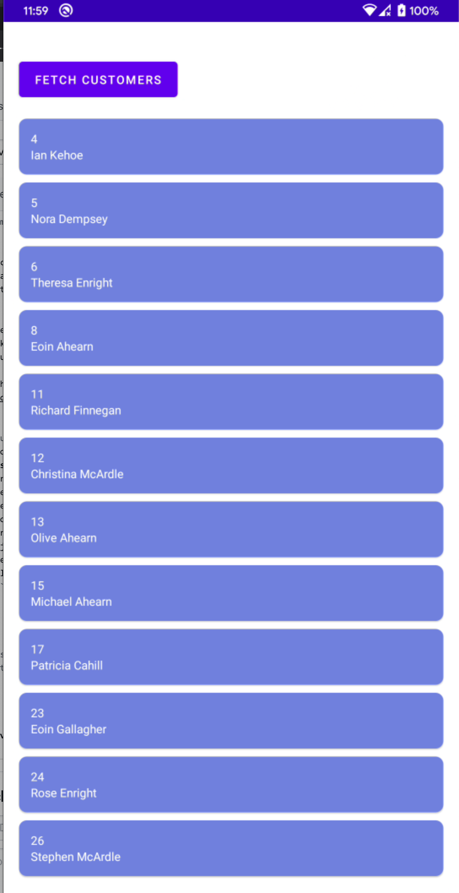
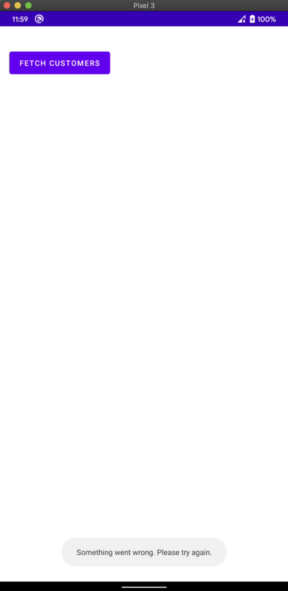

# Customers list

## How to install

#### By building via Android Studio
- Open Android Studio and select option `Project from Version Control` from `File` and enter the below link to download
```sh
https://github.com/sudansh/party.git
```
- Once downloaded it will automatically open the project in Android Studio.
- To run the app click on `Run -> Run app` option.
- When the application is running, you should see the main screen that it has a button to fetch the nearby customers. When you click it, you'll see the output of the test.

#### Direct apk
- Click on releases and download the apk files.
- Transfer the apk to you device and open the file using any file manager.
- It would ask you to install the app. Click install.

Click below for the recording of app
[View the Demo Video](https://imgur.com/5QVXvSR)

## App Flow
- Open the app `Customer Party`
- Initially it shows an empty screen with a button to fetch the customers list 
- Click on the button to make the api call. 
- A progress bar is shown while the network requests is going on
- Once the results are fetch they are shown as a list
- In case the network call fails, a toast is shown to notify the user

## About the app structure
- MVVM Architecture with Uncle bob clean architecture
- Repository pattern to fetch the data
- Koin for dependency injection
- Retrofit and Gson to call the api and parse the response
- Mockito and Espresso used to write tests
- Divided the project structure feature wise.
    - `data` folder has `network` (retrofit) and `local` (entity) related files
    - `di` has files for DI using koin
    - `repository` has `CustomerRepository` for making the api call
    - `utils` has constants and distance calculation methods
    

## Testing
- `MainActivityTest` UI test to test the button click and fetching of results
- `CustomerRepositoryTest` to test customer list is fetched and map it based on the lat,long
- `DistanceUtils` tests the various methods to calculate distance between two points and filter the customer list based on that distance
- `TestUtils` has some mock data used as common mock items.


## Proudest achievement?

- The app I worked in past called SWOO was my proudest achievement. I had designed and developed the app from scratch which crossed 1M install within 7 months and before discontinuation it was at 10M+ installs.
Also hired and built a strong team which helped me achieved those milestones.  
